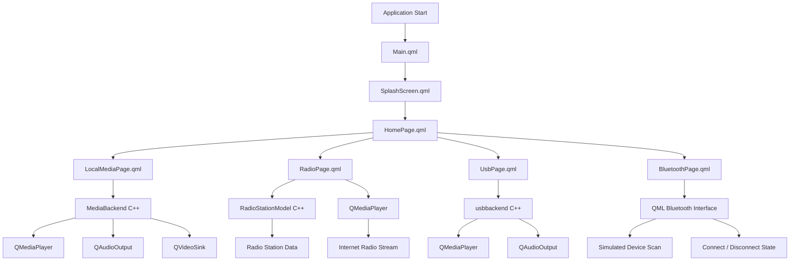

# Media Player IVI

A Qt-based **In-Vehicle Infotainment (IVI) Media Player** developed using **Qt Quick (QML)** and **C++**.

The application provides a centralized interface for accessing different media sources in an in-vehicle environment:

* Local audio and video files
* Live radio stations
* USB audio
* Bluetooth device management

The project uses **QML for the user interface** and **C++ backends for media and data management**.

---

## Features

* Modern dark-themed IVI interface
* Splash/loading screen
* Central Home page for media source selection
* Local media playback
* Audio and video support
* Playlist management
* Play, pause, stop, previous, and next controls
* Volume control
* Media progress/seek control
* Live Internet radio streaming
* Radio station selection
* USB audio playback
* USB play/pause/previous/next controls
* USB volume and progress control
* Bluetooth device scanning interface
* Bluetooth device connect/disconnect simulation
* QML/C++ communication using properties, signals, and invokable functions
* StackView-based page navigation

---

# Application Structure

The application follows this general flow:

```text
                         ┌─────────────────────┐
                         │      Main.qml       │
                         │  ApplicationWindow  │
                         └──────────┬──────────┘
                                    │
                                    ▼
                         ┌─────────────────────┐
                         │   SplashScreen.qml  │
                         │   Loading Screen    │
                         └──────────┬──────────┘
                                    │
                              After Loading
                                    │
                                    ▼
                         ┌─────────────────────┐
                         │     HomePage.qml    │
                         │    Media Player     │
                         │       Menu          │
                         └──────────┬──────────┘
                                    │
              ┌─────────────────────┼──────────────────────┐
              │                     │                      │
              ▼                     ▼                      ▼
   ┌──────────────────┐   ┌──────────────────┐   ┌──────────────────┐
   │ Local Media      │   │      Radio       │   │    USB Media     │
   │ LocalMediaPage   │   │    RadioPage     │   │     UsbPage      │
   └────────┬─────────┘   └────────┬─────────┘   └────────┬─────────┘
            │                      │                      │
            ▼                      ▼                      ▼
   ┌──────────────────┐   ┌──────────────────┐   ┌──────────────────┐
   │  MediaBackend    │   │ RadioStationModel│   │   usbbackend     │
   │      C++         │   │       C++        │   │       C++        │
   └────────┬─────────┘   └────────┬─────────┘   └────────┬─────────┘
            │                      │                      │
            ▼                      ▼                      ▼
      QMediaPlayer            Radio Streams          QMediaPlayer
      QAudioOutput             / Stations           QAudioOutput
      QVideoSink
                                   
                         ┌─────────────────────┐
                         │    Bluetooth       │
                         │ BluetoothPage.qml  │
                         └─────────────────────┘
```

---

# Navigation Structure

The application uses a `StackView` to control navigation between pages.

```text
Main.qml
   │
   ▼
SplashScreen.qml
   │
   │ replace()
   ▼
HomePage.qml
   │
   ├──────────────► LocalMediaPage.qml
   │
   ├──────────────► RadioPage.qml
   │
   ├──────────────► UsbPage.qml
   │
   └──────────────► BluetoothPage.qml
```

The `StackView` is initialized in `Main.qml`, with the splash screen as the first page.

---

# Pages

## 1. Splash Screen

### File

`SplashScreen.qml`

The Splash Screen is the first screen displayed when the application starts.

It provides:

* Media Player IVI logo
* Application title
* "Smart In-Vehicle Media System" subtitle
* Loading message
* Animated progress bar
* Loading percentage
* "Ready" status when loading finishes

A timer gradually increases the loading progress from 0% to 100%. After reaching 100%, the application waits briefly and then navigates to the Home page.

```text
Application Start
       │
       ▼
 Splash Screen
       │
       ├── Logo
       ├── Title
       ├── Loading Animation
       ├── Progress Bar
       └── Ready
       │
       ▼
    Home Page
```

---

# 2. Home Page

### File

`HomePage.qml`

The Home Page is the main menu of the application.

It provides four main options:

### Local Media

Opens the local media player.

### Radio

Opens the live radio section.

### USB Media

Opens the USB audio player.

### Bluetooth

Opens the Bluetooth device management page.

```text
                    HOME
                     │
       ┌─────────────┼─────────────┐
       │             │             │
       ▼             ▼             ▼
 Local Media       Radio        USB Media
       │             │             │
       │             │             │
       └─────────────┼─────────────┘
                     │
                     ▼
                 Bluetooth
```

---

# 3. Local Media Page

### File

`LocalMediaPage.qml`

The Local Media page is the main local audio/video player.

It allows the user to select media files from the computer and add them to a playlist.

Supported media formats include:

* MP3
* WAV
* OGG
* MP4
* MKV
* AVI

The page uses a `FileDialog` to select multiple media files.

### Main functions

* Add media files
* Display playlist
* Select a media file
* Play media
* Pause media
* Stop media
* Previous track
* Next track
* Volume control
* Progress/seek control
* Display current media
* Play video when the selected file contains video

The video output is connected to the C++ media backend through `QVideoSink`.

```text
                 Local Media
                      │
                      ▼
              Select Media Files
                      │
                      ▼
                  Playlist
                      │
          ┌───────────┼───────────┐
          │           │           │
          ▼           ▼           ▼
        Audio       Video       Media
          │           │           │
          └──────┬────┴───────────┘
                 ▼
           MediaBackend
                 │
       ┌─────────┼─────────┐
       ▼         ▼         ▼
 QMediaPlayer  Audio     Video
               Output    Output
```

---

# 4. Radio Page

### File

`RadioPage.qml`

The Radio page provides access to live Internet radio stations.

The current project contains radio stations such as:

* Radio 9090
* Mix FM
* On Sport FM
* Arab Mix Drama

Each station has:

* Station name
* Frequency or online label
* Streaming URL

The user can select a station and start or stop playback.

### Main functions

* Display available stations
* Select a station
* Show current station
* Show frequency
* Play live radio
* Stop radio
* Display connection/playback status
* Handle radio playback errors

```text
                    RADIO
                      │
                      ▼
               Radio Stations
                      │
        ┌─────────────┼─────────────┐
        │             │             │
        ▼             ▼             ▼
    Radio 9090      Mix FM       On Sport FM
        │             │             │
        └─────────────┼─────────────┘
                      │
                      ▼
                 Stream URL
                      │
                      ▼
                 MediaPlayer
                      │
                      ▼
                 AudioOutput
```

---

# 5. USB Media Page

### File

`UsbPage.qml`

The USB page provides audio playback through the C++ USB backend.

The current project contains test audio files such as:

* Khatfony
* Ray'a
* Tamally maak

The page communicates with `usbbackend` through the `usbBackend` context property registered in `main.cpp`.

### Main functions

* Display USB audio files
* Select a track
* Play
* Pause
* Resume
* Stop
* Previous track
* Next track
* Volume control
* Position/progress control
* Display current track
* Display playback status

The USB backend uses:

* `QMediaPlayer`
* `QAudioOutput`

```text
                    USB PAGE
                       │
                       ▼
                 USB File List
                       │
          ┌────────────┼────────────┐
          │            │            │
          ▼            ▼            ▼
       Khatfony      Ray'a      Tamally maak
          │            │            │
          └────────────┼────────────┘
                       │
                       ▼
                  usbbackend
                       │
              ┌────────┴────────┐
              ▼                 ▼
         QMediaPlayer      QAudioOutput
              │                 │
              ▼                 ▼
          Playback           Volume
```

---

# 6. Bluetooth Page

### File

`BluetoothPage.qml`

The Bluetooth page provides a user interface for Bluetooth device management.

It includes:

* Bluetooth enable/disable switch
* Scan for devices button
* Available device list
* Device names
* Device addresses
* Connect button
* Disconnect button
* Connected-device status

The current implementation uses QML state and a timer to simulate scanning. It displays example devices such as:

* Samsung Galaxy
* Car Audio
* Wireless Headphones
* Samar's Phone

The connect/disconnect actions update the displayed connection state.

```text
                 BLUETOOTH
                     │
                     ▼
             Enable Bluetooth
                     │
                     ▼
             Scan for Devices
                     │
                     ▼
              Available Devices
                     │
        ┌────────────┼────────────┐
        │            │            │
        ▼            ▼            ▼
     Device 1     Device 2     Device 3
        │            │            │
        └────────────┼────────────┘
                     │
                     ▼
              Connect / Disconnect
                     │
                     ▼
              Connected Status
```

> **Note:** Bluetooth functionality is currently implemented as a QML simulation/interface rather than a real Bluetooth C++ backend.

---

# C++ Backend Architecture

The project uses three main C++ components.

## MediaBackend

### Files

```text
mediabackend.h
mediabackend.cpp
```

`MediaBackend` manages local media playback.

It exposes properties such as:

* Position
* Duration
* Volume
* Playing state
* Current file name
* Video availability

It also manages:

* `QMediaPlayer`
* `QAudioOutput`
* `QVideoSink`

This allows QML to control the media player without directly implementing all playback logic.

---

## RadioStationModel

### Files

```text
radiostationmodel.h
radiostationmodel.cpp
```

`RadioStationModel` is a C++ `QAbstractListModel`.

It represents radio station information and exposes:

* Station name
* Frequency
* Stream URL
* Current station
* Playing state

The model is registered in `main.cpp` as:

```text
radioModel
```

QML can therefore access the C++ radio model directly.

---

## USB Backend

### Files

```text
usbbackend.h
usbbackend.cpp
```

The USB backend handles USB audio playback.

It exposes:

* Current track name
* Playing state
* Volume
* Position
* Duration

It provides functions for:

* Play track
* Play/pause toggle
* Stop
* Change position

The backend uses:

```text
QMediaPlayer
QAudioOutput
```

The object is registered in QML as:

```text
usbBackend
```

---

# Backend Communication

The overall QML/C++ communication structure is:

```text
                         main.cpp
                            │
             ┌──────────────┼───────────────┐
             │              │               │
             ▼              ▼               ▼
       mediaBackend     radioModel      usbBackend
             │              │               │
             ▼              ▼               ▼
      MediaBackend   RadioStationModel   usbbackend
             │              │               │
             ▼              ▼               ▼
       Local Media        Radio             USB
```

`main.cpp` creates the C++ backend objects and exposes them to QML using `QQmlContext::setContextProperty()`.

---

# Reusable Components

## MediaButton.qml

`MediaButton.qml` is a reusable custom button component for media controls.

It provides configurable:

* Icon source
* Button size
* Icon size

It is used by the Local Media page for controls such as:

* Previous
* Play/Pause
* Stop
* Next

This avoids duplicating the same button design throughout the application.

---

# Project File Structure

```text
GraduationProject/
│
├── CMakeLists.txt
│
├── main.cpp
│
├── Main.qml
│
├── SplashScreen.qml
│
├── HomePage.qml
│
├── LocalMediaPage.qml
│
├── RadioPage.qml
│
├── UsbPage.qml
│
├── BluetoothPage.qml
│
├── MediaButton.qml
│
├── mediabackend.h
├── mediabackend.cpp
│
├── radiostationmodel.h
├── radiostationmodel.cpp
│
├── usbbackend.h
├── usbbackend.cpp
│
└── resources/
    │
    ├── audio/
    └── icons/
```

---

# Complete System Architecture



---

# Technologies Used

## Frontend

* Qt Quick
* QML
* Qt Quick Controls
* Qt Quick Layouts
* Qt Multimedia
* Qt Dialogs
* StackView
* ListView
* ListModel

## Backend

* C++
* QObject
* QMediaPlayer
* QAudioOutput
* QVideoSink
* QAbstractListModel
* Qt signals and properties
* QML/C++ context properties

## Build System

* CMake
* Qt 6

The project is configured as `MediaPlayerIVI` and uses C++ with Qt.

---

# Application Flow

```text
┌─────────────────────┐
│       START         │
└──────────┬──────────┘
           │
           ▼
┌─────────────────────┐
│   Splash Screen     │
│                     │
│ Loading → Ready     │
└──────────┬──────────┘
           │
           ▼
┌─────────────────────┐
│     Home Page       │
└──────────┬──────────┘
           │
     ┌─────┼─────┬─────────┐
     │     │     │         │
     ▼     ▼     ▼         ▼
   Local  Radio  USB   Bluetooth
   Media        Media
     │     │     │         │
     ▼     ▼     ▼         ▼
  C++     C++   C++      QML
 Backend Model Backend  Simulation
```

---

# Design

The application uses a dark IVI-style interface with:

* Dark navy background
* Purple accent color
* Rounded panels
* Large touch-friendly buttons
* Clear media controls
* Consistent spacing
* High-contrast white text

The design is intended to provide a clean interface suitable for an in-vehicle media system.

---

# How to Run

## Requirements

* Qt 6
* Qt Creator
* C++ compiler
* CMake
* Qt Multimedia module

## Steps

1. Clone the repository.
2. Open the `GraduationProject` folder in Qt Creator.
3. Configure the project with a Qt 6 kit.
4. Make sure the required audio/icon resources are available.
5. Build the project.
6. Run the application.
7. The application starts at the Splash Screen and automatically opens the Home Page.

---

# Media Controls

### Local Media

```text
Previous → Play/Pause → Stop → Next
              │
              ▼
        Progress Slider
              │
              ▼
         Volume Slider
```

### USB Media

```text
Previous → Play/Pause → Next
              │
              ▼
        Progress Slider
              │
              ▼
         Volume Slider
```

### Radio

```text
Select Station
      │
      ▼
    Play
      │
      ▼
Live Radio Stream
      │
      ▼
    Stop
```

---

# Future Improvements

Possible future improvements include:

* Real Bluetooth hardware integration
* Automatic USB device detection
* Reading real audio files directly from connected USB storage
* Automatic next-track playback
* Mute functionality
* Bluetooth audio streaming
* Favorite radio stations
* Search for radio stations
* Album artwork
* Media metadata display
* Steering-wheel control integration
* Vehicle CAN bus integration
* Persistent user settings
* Real automotive hardware deployment

---

# Project Goal

The goal of **Media Player IVI** is to provide a modular and user-friendly media system suitable for an automotive infotainment environment.

The project demonstrates the integration of:

```text
Qt Quick UI
      +
C++ Backend
      +
Qt Multimedia
      +
Audio/Video Playback
      +
Internet Radio
      +
USB Media
      +
Bluetooth Interface
```

---

# Repository

GitHub repository:

https://github.com/samaralsherbeny/Qt/tree/main/GraduationProject

---

# Author

**Samar Alsherbeny**

Qt / C++ Graduation Project
